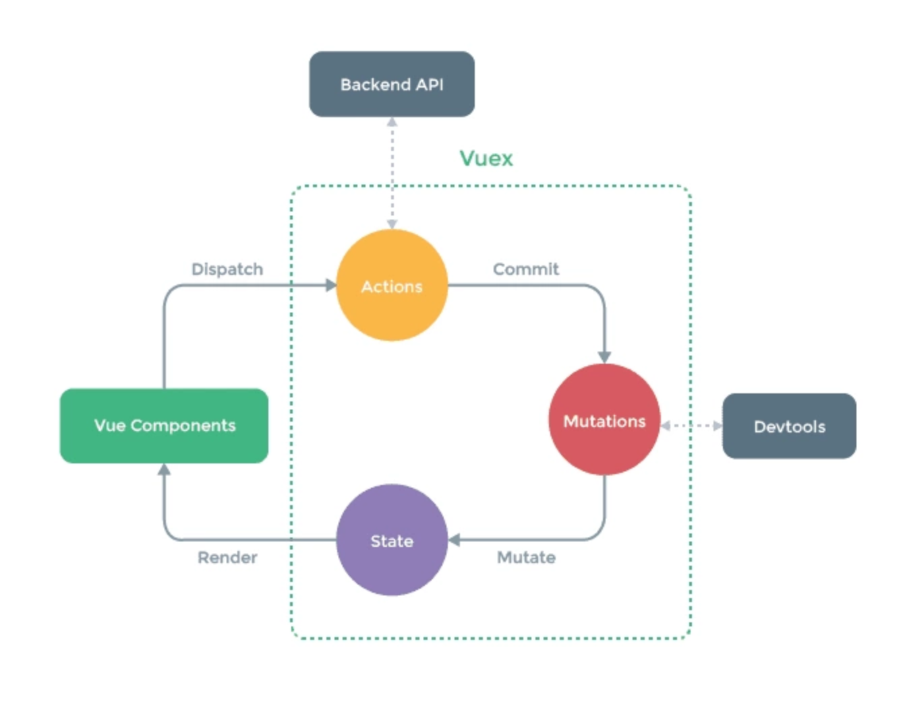

本文主要记录一些前端常见问题（高频面试题）和自己不太清楚的问题。长期整理更新……。目的是自己掌握不好的， 逐一消化！

<!-- more -->

## webpack 核心概念:
- Entry: 入口
- Module:模块，webpack中一切皆是模块
- Chunk:代码库，一个chunk由十多个模块组合而成，用于代码合并与分割
- Loader:模块转换器，用于把模块原内容按照需求转换成新内容
- Plugin:扩展插件，在webpack构建流程中的特定时机注入扩展逻辑来改变构建结果或做你想要做的事情
- Output: 输出结果


## 判断变量数据类型
```js
var obj = {a:1}
Object.prototype.toString.call(obj) // "[object Object]"
obj.constructor === Object // true
```

## 手写一个JS深拷贝
```js
function deepCopy(obj){
    //判断是否是简单数据类型，
    if(typeof obj == "object"){
        //复杂数据类型
        var result = obj.constructor == Array ? [] : {};
        for(let i in obj){
            result[i] = typeof obj[i] == "object" ? deepCopy(obj[i]) : obj[i];
        }
    }else {
        //简单数据类型 直接 = 赋值
        var result = obj;
    }
    return result;
}
```

## 手写一个 Promise


## 浏览器事件代理机制的原理是什么？

## 跨域的方法有哪些？原理是什么？

## JS实现快速排序

大致分三步：

1、找基准（一般是以中间项为基准）

2、遍历数组，小于基准的放在left，大于基准的放在right

3、递归
```js
function quickSort(arr){
    //如果数组<=1,则直接返回
    if(arr.length<=1){return arr;}
    var pivotIndex=Math.floor(arr.length/2);
    //找基准，并把基准从原数组删除
    var pivot=arr.splice(pivotIndex,1)[0];
    //定义左右数组
    var left=[];
    var right=[];

    //比基准小的放在left，比基准大的放在right
    for(var i=0;i<arr.length;i++){
        if(arr[i]<=pivot){
            left.push(arr[i]);
        }
        else{
            right.push(arr[i]);
        }
    }
    //递归
    return quickSort(left).concat([pivot],quickSort(right));
}
```

## requestAnimationFrame

（和 setTimeout/setInterval 有什么区别？使用 requestAnimationFrame 有哪些好处？）

[参考: requestAnimationFrame 知多少？](https://www.cnblogs.com/onepixel/p/7078617.html)


---
> CSS

## CSS
### rem和em的区别?

### 如何做页面适配
   
---      
> Vue常见面试题：

## Vue

### vue.js的两个核心是什么？
数据驱动、组件系统 

### 对于MVVM的理解？
MVVM 是 Model-View-ViewModel 的缩写。

Model代表数据模型，也可以在Model中定义数据修改和操作的业务逻辑。

View 代表UI 组件，它负责将数据模型转化成UI 展现出来。

ViewModel 监听模型数据的改变和控制视图行为、处理用户交互，简单理解就是一个同步View 和 Model的对象，连接Model和View。

在MVVM架构下，View 和 Model 之间并没有直接的联系，而是通过ViewModel进行交互，Model 和 ViewModel 之间的交互是双向的， 因此View 数据的变化会同步到Model中，而Model 数据的变化也会立即反应到View 上。

ViewModel 通过`双向数据绑定`把 View 层和 Model 层连接了起来，而View 和 Model 之间的同步工作完全是自动的，无需人为干涉，因此开发者只需关注业务逻辑，不需要手动操作DOM, 不需要关注数据状态的同步问题，复杂的数据状态维护完全由 MVVM 来统一管理。

### Vue的生命周期
- beforeCreate（创建前） 在数据观测和初始化事件还未开始
- created（创建后） 完成数据观测，属性和方法的运算，初始化事件，$el属性还没有显示出来
- beforeMount（载入前） 在挂载开始之前被调用，相关的render函数首次被调用。实例已完成以下的配置：编译模板，把data里面的数据和模板生成html。注意此时还没有挂载html到页面上。
- mounted（载入后） 在el 被新创建的 vm.$el 替换，并挂载到实例上去之后调用。实例已完成以下的配置：用上面编译好的html内容替换el属性指向的DOM对象。完成模板中的html渲染到html页面中。此过程中进行ajax交互。
- beforeUpdate（更新前） 在数据更新之前调用，发生在虚拟DOM重新渲染和打补丁之前。可以在该钩子中进一步地更改状态，不会触发附加的重渲染过程。
- updated（更新后） 在由于数据更改导致的虚拟DOM重新渲染和打补丁之后调用。调用时，组件DOM已经更新，所以可以执行依赖于DOM的操作。然而在大多数情况下，应该避免在此期间更改状态，因为这可能会导致更新无限循环。该钩子在服务器端渲染期间不被调用。
- beforeDestroy（销毁前） 在实例销毁之前调用。实例仍然完全可用。
- destroyed（销毁后） 在实例销毁之后调用。调用后，所有的事件监听器会被移除，所有的子实例也会被销毁。该钩子在服务器端渲染期间不被调用。

#### 什么是vue生命周期？
Vue 实例从创建到销毁的过程，就是生命周期。从开始创建、初始化数据、编译模板、挂载Dom→渲染、更新→渲染、销毁等一系列过程，称之为 Vue 的生命周期。

#### vue生命周期的作用是什么？
它的生命周期中有多个事件钩子，让我们在控制整个Vue实例的过程时更容易形成好的逻辑。

#### vue生命周期总共有几个阶段？
它可以总共分为8个阶段：创建前/后, 载入前/后,更新前/后,销毁前/销毁后。

#### 第一次页面加载会触发哪几个钩子？
会触发 下面这几个beforeCreate, created, beforeMount, mounted 。

#### DOM 渲染在 哪个周期中就已经完成？
DOM 渲染在 mounted 中就已经完成了。

### Vue实现数据双向绑定的原理：Object.defineProperty（）
vue实现数据双向绑定主要是：采用**数据劫持结合发布者-订阅者模式**的方式，通过`Object.defineProperty()`来劫持各个属性的setter，getter，在数据变动时发布消息给订阅者，触发相应监听回调。当把一个普通 Javascript 对象传给 Vue 实例来作为它的 data 选项时，Vue 将遍历它的属性，用 Object.defineProperty 将它们转为 getter/setter。用户看不到 getter/setter，但是在内部它们让 Vue 追踪依赖，在属性被访问和修改时通知变化。

vue的数据双向绑定 将MVVM作为数据绑定的入口，整合Observer，Compile和Watcher三者，通过Observer来监听自己的model的数据变化，通过Compile来解析编译模板指令，最终利用watcher搭起observer和Compile之间的通信桥梁，达到数据变化 —>视图更新；视图交互变化（input）—>数据model变更双向绑定效果。

js实现简单的双向绑定
```js
<body>
    <div id="app">
    <input type="text" id="txt">
    <p id="show"></p>
</div>
</body>
<script type="text/javascript">
    var obj = {}
    Object.defineProperty(obj, 'txt', {
        get: function () {
            return obj
        },
        set: function (newValue) {
            document.getElementById('txt').value = newValue
            document.getElementById('show').innerHTML = newValue
        }
    })
    document.addEventListener('keyup', function (e) {
        obj.txt = e.target.value
    })
</script>
```

### 实现双向绑定 Proxy 与 Object.defineProperty 相比优劣如何?

### 聊聊你对Vue.js的template编译的理解？

简而言之，就是先转化成AST树，再得到的render函数返回VNode（Vue的虚拟DOM节点）

详情步骤：

首先，通过compile编译器把template编译成AST语法树（abstract syntax tree 即 源代码的抽象语法结构的树状表现形式），compile是createCompiler的返回值，createCompiler是用以创建编译器的。另外compile还负责合并option。

然后，AST会经过generate（将AST语法树转化成render funtion字符串的过程）得到render函数，render的返回值是VNode，VNode是Vue的虚拟DOM节点，里面有（标签名、子节点、文本等等）

### Vue组件间的参数传递
- #### 父组件与子组件传值
  父组件传给子组件：子组件通过props方法接受数据;
  子组件传给父组件：$emit方法传递参数
- #### 非父子组件间的数据传递，兄弟组件传值
  **eventBus**，就是创建一个事件中心，相当于中转站，可以用它来传递事件和接收事件。项目比较小时，用这个比较合适。（虽然也有不少人推荐直接用VUEX，具体来说看需求咯。技术只是手段，目的达到才是王道。）

### vue-router的原理

**更改浏览器的URL，更新视图但不重新请求页面**

vue-router实现单页面路由跳转，提供了三种方式：hash模式、history模式、abstract模式，根据mode参数来决定采用哪一种方式。
- Hash模式：hash即浏览器url中#后面的内容，包含#。hash是URL中的锚点，代表的是网页中的一个位置，单单改变#后的部分，浏览器只会加载相应位置的内容，不会重新加载页面。
- History模式：HTML5 History API提供了一种功能，能让开发人员在不刷新整个页面的情况下修改站点的URL，就是利用 history.pushState API 来完成 URL 跳转而无须重新加载页面；
- abstract模式：abstract模式是使用一个不依赖于浏览器的浏览历史虚拟管理后端。
根据平台差异可以看出，在 Weex 环境中只支持使用 abstract 模式。 不过，vue-router 自身会对环境做校验，如果发现没有浏览器的 API，vue-router 会自动强制进入 abstract 模式，所以 在使用 vue-router 时只要不写 mode 配置即可，默认会在浏览器环境中使用 hash 模式，在移动端原生环境中使用 abstract 模式。 （当然，你也可以明确指定在所有情况下都使用 abstract 模式）。

### $route和$router的区别
$route是“路由信息对象”，包括path，params，hash，query，fullPath，matched，name等路由信息参数。而$router是“路由实例”对象包括了路由的跳转方法，钩子函数等。

### vue中 key 值的作用？
当 Vue.js 用 v-for 正在更新已渲染过的元素列表时，它默认用“就地复用”策略。如果数据项的顺序被改变，Vue 将不会移动 DOM 元素来匹配数据项的顺序， 而是简单复用此处每个元素，并且确保它在特定索引下显示已被渲染过的每个元素。key的作用主要是为了**高效的更新虚拟DOM**。

### 什么是vue的计算属性？
在模板中放入太多的逻辑会让模板过重且难以维护，在需要对数据进行复杂处理，且可能多次使用的情况下，尽量采取计算属性的方式。好处：①使得数据处理结构清晰；②依赖于数据，数据更新，处理结果自动更新；③计算属性内部this指向vm实例；④在template调用时，直接写计算属性名即可；⑤常用的是getter方法，获取数据，也可以使用set方法改变数据；⑥相较于methods，不管依赖的数据变不变，methods都会重新计算，但是依赖数据不变的时候computed从缓存中获取，不会重新计算。

### vue等单页面应用及其优缺点
优点：Vue 的目标是通过尽可能简单的 API 实现响应的数据绑定和组合的视图组件，核心是一个响应的数据绑定系统。MVVM、数据驱动、组件化、轻量、简洁、高效、快速、模块友好。

缺点：不支持低版本的浏览器，最低只支持到IE9；不利于SEO的优化（如果要支持SEO，建议通过服务端来进行渲染组件）；第一次加载首页耗时相对长一些；不可以使用浏览器的导航按钮需要自行实现前进、后退。

### Vuex状态管理模式


只用来读取的状态集中放在store中； 改变状态的方式是提交mutations，这是个同步的事物； 异步逻辑应该封装在action中。

在main.js引入store，注入。新建了一个目录store，….. export 。

场景有：单页应用中，组件之间的状态、音乐播放、登录状态、加入购物车
  ```js
  const store = new Vuex.Store({ //store实例
      state: {
         count: 0
             },
      mutations: {                
         increment (state) {
          state.count++
         }
          },
      actions: { 
         increment (context) {
          context.commit('increment')
   }
 }
})
  ```
#### vuex有哪几种属性？

  有五种，分别是 State、 Getter、Mutation 、Action、 Module

#### vuex的State特性是？
  
  - Vuex就是一个仓库，仓库里面放了很多对象。其中state就是数据源存放地，对应于与一般Vue对象里面的data
  - state里面存放的数据是响应式的，Vue组件从store中读取数据，若是store中的数据发生改变，依赖这个数据的组件也会发生更新
  - 它通过mapState把全局的 state 和 getters 映射到当前组件的 computed 计算属性中

#### vuex的Getter特性是？
  - getters 可以对State进行计算操作，它就是Store的计算属性
  - 虽然在组件内也可以做计算属性，但是getters 可以在多组件之间复用
  - 如果一个状态只在一个组件内使用，是可以不用getters

#### vuex的Mutation特性是？
  - Action 类似于 mutation，不同在于：
  - Action 提交的是 mutation，而不是直接变更状态。
  - Action 可以包含任意异步操作

#### Vue.js中ajax请求代码应该写在组件的methods中还是vuex的actions中
  - 如果请求来的数据不是要被其他组件公用，仅仅在请求的组件内使用，就不需要放入vuex 的state里。
  - 如果被其他地方复用，这个很大几率上是需要的，如果需要，请将请求放入action里，方便复用，并包装成promise返回，在调用处用async await处理返回的数据。如果不要复用这个请求，那么直接写在vue文件里很方便。

#### *不用Vuex会带来什么问题？
  - 可维护性会下降，你要想修改数据，你得维护三个地方
  - 可读性会下降，因为一个组件里的数据，你根本就看不出来是从哪来的
  - 增加耦合，大量的上传派发，会让耦合性大大的增加，本来Vue用Component就是为了减少耦合，现在这么用，和组件化的初衷相背。

  但兄弟组件有大量通信的，建议一定要用，不管大项目和小项目，因为这样会省很多事


---
参与及原文引用
- [Vue面试中，经常会被问到的面试题/Vue知识点整理](https://segmentfault.com/a/1190000016344599)
- [Vuex状态管理模式的面试题及答案](http://www.bslxx.com/a/vue/mianshiti/2017/1024/1075.html)